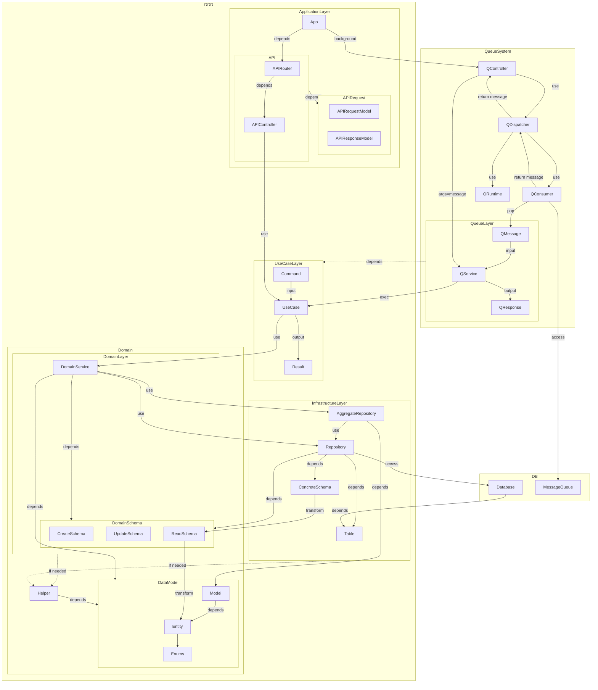

# アーキテクチャ図

## パッケージの分離
各packageは、/backend/packageに記載。

- core: 抽象的な設計、汎用的な関数の提供
- auth: user管理
- problem-system: 問題の提供、識別
- judge-system: 提出したコードの実行
- edutorial-system: 問題の解説を管理する
- seed: 指定のリポジトリをcloneすれば、問題集を自作・配布することができる。seedはそのimport処理を書く。

## ひとつのパッケージのアーキテクチャ

